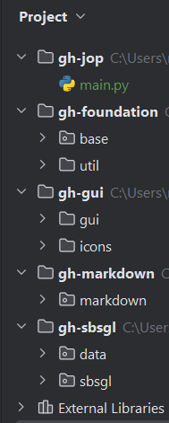

> ** Preliminary work **
Next gen of JopLauncher https://github.com/joetjo/jopLauncher

### Requirement
- python 3.11.1 - https://www.python.org/downloads/

### PyCharm
- A pycharm project by module
- Attach all projects to gh-jop project to have all projects in a single PyCharm
- Use a single venv at root level

### Project links
> https://github.com/users/joetjo/projects/2/views/1

### "Release" a version
- update version number in __init__ of each projects
